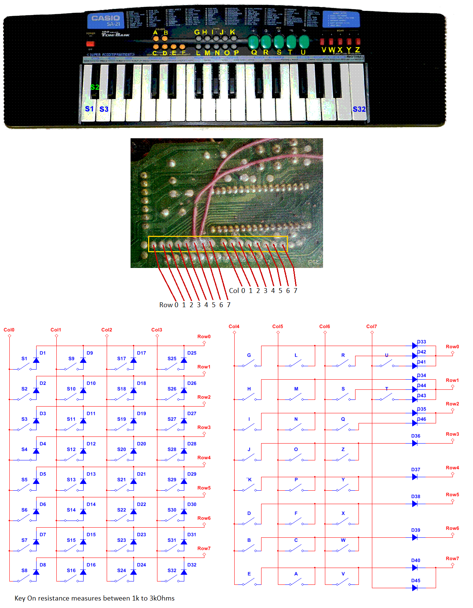
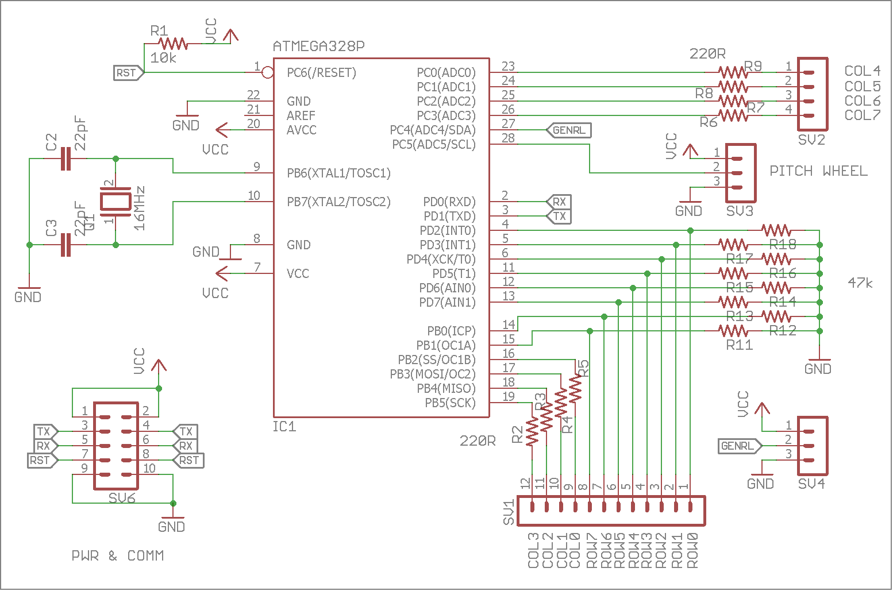
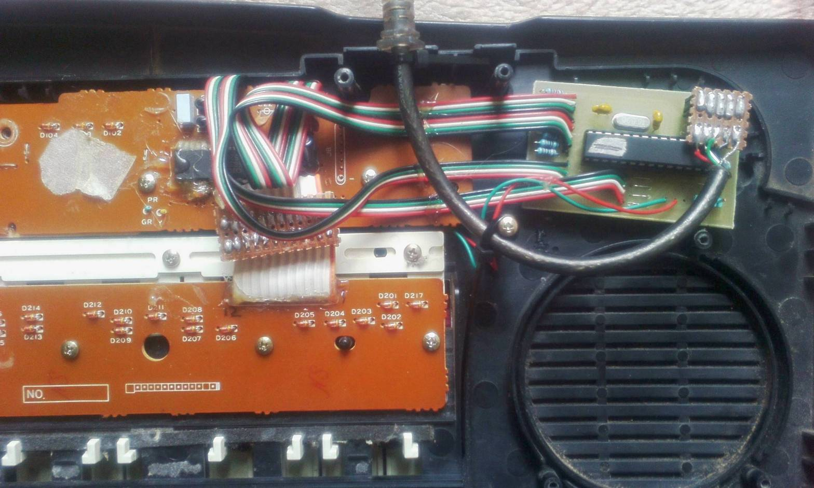

## Casio SA-21 midi conversion
A simple project to transform an old Casio keyboard into a MIDI controller, based around the ATmega328P microcontroller and 
Arduino enviroment.

### Main features
- Octave shifting
- Key transpose
- Adjustable note velocity
- Support for 5 midi channels

### Requirements for PC connection  
- Serial to USB module if using a stand-alone ATmega328P.
- Hairless MIDI to Serial Bridge for MIDI communication.
- LoopMIDI for virtual MIDI port creation.

### Hardware and shematics

You will need to desolder the original chip that comes with the keyboard so that it does not interfere
with the microcontroller. In my case I simply cut its pins to the key and button matrices. 
